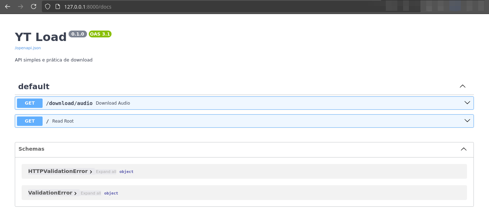

# YT LOAD API - Downloader de Áudio do YouTube

Este é um projeto para baixar áudio de vídeos do YouTube e convertê-los para o formato MP3. Utiliza as bibliotecas [pytubefix](https://pypi.org/project/pytubefix/) e [pydub](https://pydub.com/) para realizar o download e conversão, além de ser construído com o framework [FastApi](https://fastapi.tiangolo.com/) para fornecer uma API para interagir com o serviço.

## Estrutura de Diretórios

A estrutura do projeto é a seguinte:

```
YT LOAD
├── downloads # Diretório para armazenar temporariamente os arquivos baixados
├── src
│ ├── routers # Controladores de rotas da API, onde as rotas e endpoints são definidos
│ │ ├── init.py
│ │ └── download.py
│ ├── services # Lógica de serviços de download e conversão, responsável por processar os arquivos
│ │ ├── init.py
│ │ └── download_audio.py
│ ├── utils # Utilitários, como conversão e manipulação de arquivos
│ │ ├── init.py
│ │ ├── convert_to_mp3.py
│ │ ├── file_manager.py
│ │ └── remove_file.py
│ ├── init.py
│ └── main.py # Ponto de entrada da aplicação FastAPI, onde a aplicação é inicializada
└── tests # Diretório para testes unitários e de integração da aplicação
```

## Como Rodar o Projeto com Docker

### Requisitos

- Docker e Docker Compose instalados no sistema.

### Suba os containers em backgorund

```bash
docker-compose up -d
```

Caso deseje verificar os logs em tempo real execute:

```bash
docker-compose logs -f
```

## Como Rodar o Projeto Local

### Requisitos

- Python 3.8 ou superior
- [PDM](https://pdm.fming.dev/) como gerenciador de pacotes

### Passos para Configuração

1. Clone o repositório.

2. Crie o ambiente virtual e instale as dependências:

   ```bash
   pdm install
   ```

3. Inicie o servidor FastAPI:

   ```bash
   pdm run start
   ```

O servidor será iniciado em `http://127.0.0.1:8000`, e você poderá acessar a documentação da API em `http://127.0.0.1:8000/docs` ou `http://127.0.0.1:8000/redoc`.


